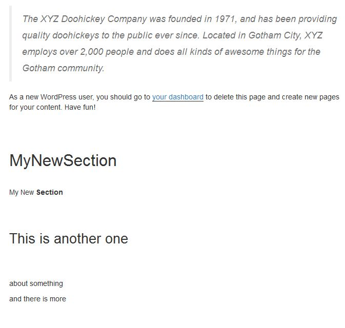

# WP Section Builder

A simple and easy Section Builder which can be used to create simple GRIDs by using WordPress Custom Post Types.

If you are fed on Drag & Drop grids and you want to control the actual layout for you clients but again enable them to use custom widgets and something similar you can use this code and create as many sections / metaboxes and etc for your layout / theme.

## Sections

Sections are actually the post types you create to use. 

## Metaboxes

Metaboxes are classes which are used to create various metaboxes. You can extend them with fields and anything you want.

## Builders

Builders are the classes with methods to build your layout. 

In the example you can see a Home Section builder where the HomeBootstrap class extends the Builder class and implements a way to generate Bootstrap 3 layout.

#Usage

Creating the Section with the Builder, you will create a post type with a metabox connected to the select element with pages listed. 

Builders decide how a layout is displayed while Sections are displaying the layout with their content on the bottom of the page.

#Screenshots

Custom Post Type for the Section:

A section created on the front part for the dummy sample page in WordPress:

The Bootstrap Classes and HTML inserted by Builder class (HomeBootstrap):

An example of a custom sidebar Content to show that Bootstrap Classes and HTML works:

#TODO

- Create a completed Get Started Guide with code examples
- Create a better autoloading function to include all classes and subclasses
- Add more flexibility to default meta box creation
- Add a method to add more metaboxes
- Add a method to enqueue scripts with builders
- Populate Sidebar Content with additional metaboxes

